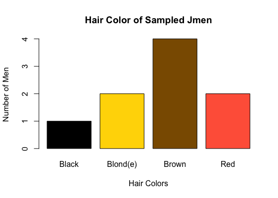

```{r setup, include=FALSE}
knitr::opts_chunk$set(echo = TRUE)
```

## Target Graph


My goal was to reproduce the above graph showing the hair color of sampled Jmen.
```{r data}
jmen <- read.table("jmen.txt", header = TRUE)
```

## Imitation Graph
```{r graph}
barplot(table(jmen$Hair), col = c ("black", "gold", "orange4", "tomato"), main = "Hair Color of Sampled Jmen", xlab = "Hair Colors", ylab = "Number of Men", names.arg = c ("Black", "Blond(e)", "Brown", "Red"))
```

I was able to reproduce the graph fairly well but the colors may be slightly off. I had to select colors based on eye judgment because the code which produced the original graph was not made available. 


